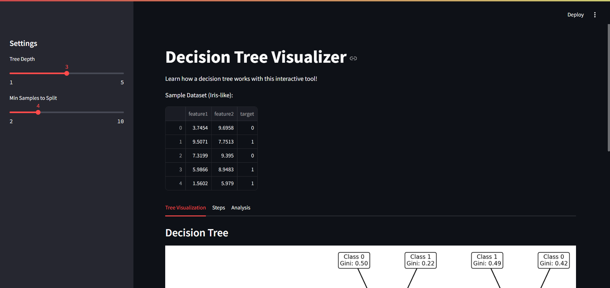
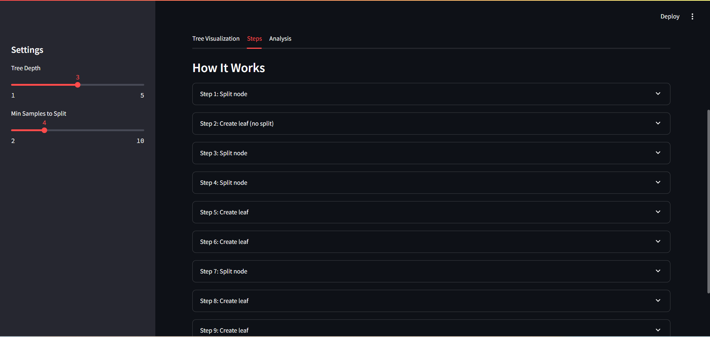
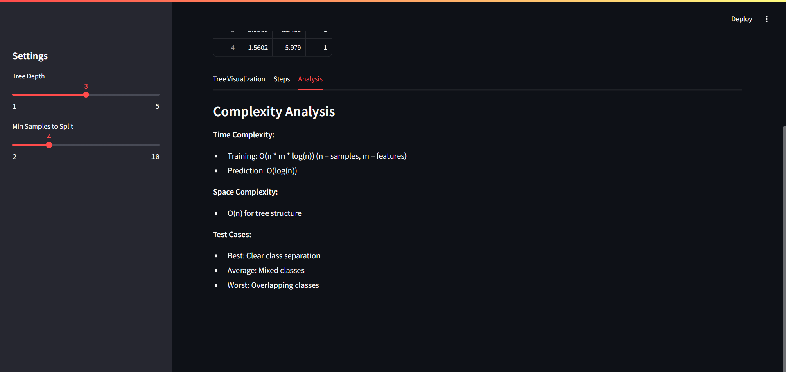
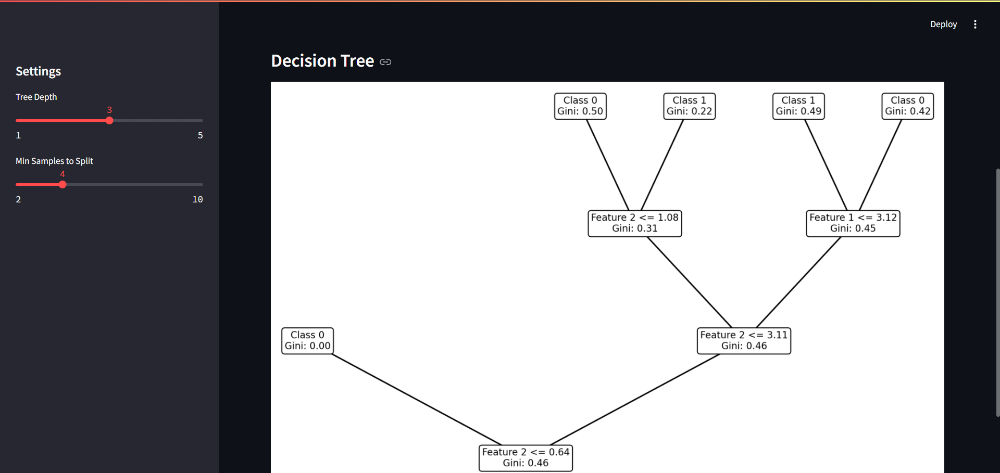

# Decision Tree Visualization - Interactive Visualization

## Project Overview

This project is an interactive web application that implements and visualizes Desicion Tree Visualization, developed as part of the Algorithms and Programming II course at Fırat University, Software Engineering Department. The application provides a comprehensive tool for understanding how decision trees work, including step-by-step construction, visual representation, and performance analysis.

## Algorithm Description

The Decision Tree algorithm is a supervised machine learning method used for classification tasks. This project implements a decision tree classifier to demonstrate binary classification on a simple dataset with two numerical features. The algorithm constructs a tree by recursively splitting the data into regions based on feature thresholds, aiming to minimize node impurity. The interactive visualization shows the tree structure, step-by-step execution, and complexity analysis, making it an educational tool for understanding decision trees.

### Problem Definition

The Decision Tree algorithm solves a binary classification problem by recursively partitioning the input space into regions based on feature values. Given a dataset with numerical features and class labels, it constructs a tree to classify new data points by following decision rules.

### Mathematical Background

The algorithm uses Gini Impurity to measure the purity of a node:
[ G = 1 - \sum_{i=1}^c p_i^2 ]
where ( p_i ) is the probability of class ( i ), and ( c ) is the number of classes (here, ( c=2 )). The goal is to minimize Gini impurity at each split to create pure nodes.

### Algorithm Steps

1. Calculate Gini Impurity: Compute the impurity of the current node based on class distribution.
2. Find Best Split: Evaluate all possible splits across features and thresholds to find the one that minimizes weighted Gini impurity.
3. Create Node: If stopping criteria (max depth or min samples) are met, create a leaf node with the majority class; otherwise, create a decision node with the best split.
4. Recurse: Split the data into left and right subsets and repeat the process for child nodes until stopping criteria are met.

### Pseudocode

```
function DecisionTree(X, y, depth):
    if depth >= max_depth or len(y) < min_samples_split:
        return Node(value=majority_class(y), gini=gini_impurity(y))
    
    best_feature, best_threshold, best_gini = find_best_split(X, y)
    if best_feature is None:
        return Node(value=majority_class(y), gini=gini_impurity(y))
    
    left_indices = X[best_feature] <= best_threshold
    right_indices = X[best_feature] > best_threshold
    
    node = Node(feature=best_feature, threshold=best_threshold, gini=best_gini)
    node.left = DecisionTree(X[left_indices], y[left_indices], depth + 1)
    node.right = DecisionTree(X[right_indices], y[right_indices], depth + 1)
    
    return node

function gini_impurity(y):
    counts = count_classes(y)
    m = len(y)
    return 1 - sum((count/m)^2 for count in counts)

function find_best_split(X, y):
    best_gini = infinity
    for feature in features:
        for threshold in unique(X[feature]):
            left_y, right_y = split_data(X, y, feature, threshold)
            if len(left_y) < min_samples_split or len(right_y) < min_samples_split:
                continue
            gini = (len(left_y) * gini_impurity(left_y) + len(right_y) * gini_impurity(right_y)) / m
            if gini < best_gini:
                best_gini = gini
                best_feature = feature
                best_threshold = threshold
    return best_feature, best_threshold, best_gini
```

## Complexity Analysis

### Time Complexity

- **Best Case:** O(n \cdot m \cdot \log(n)) - When data is easily separable, splits are balanced, but all features and thresholds must still be evaluated.
- **Average Case:** O(n \cdot m \cdot \log(n)) - Typical case with moderately complex data, requiring full evaluation of splits.
- **Worst Case:** O(n \cdot m \cdot \log(n)) -  Even with overlapping classes, the algorithm evaluates all possible splits, where ( n ) is the number of samples and ( m ) is the number of features.

### Space Complexity

- O(n) - The tree structure stores nodes proportional to the dataset size, and recursion stack depth is limited by max_depth.

## Features

- Interactive visualization of the decision tree structure.
- Step-by-step explanation of the algorithm’s execution.
- Complexity analysis with clear explanations.
- Adjustable parameters (max depth, min samples to split) via sliders.
...

## Screenshots


*Main interface showing the decision tree visualization and sample dataset.*


*Step-by-step explanation tab displaying the algorithm's process.*


*Complexity analysis tab showing time and space complexity details.*


*Example decision tree structure with node splits and Gini values.*

## Installation

### Prerequisites

- Python 3.8 or higher
- Git

### Setup Instructions

1. Clone the repository:
   ```bash
   git clone https://github.com/FiratUniversity-IJDP-SoftEng/algorithms-and-programming-ii-semester-capstone-project-osmanilkerkara.git
   cd algorithms-and-programming-ii-semester-capstone-project-osmanilkerkara
   ```

2. Create a virtual environment:
   ```bash
   # On Windows
   python -m venv venv
   venv\Scripts\activate

   # On macOS/Linux
   python3 -m venv venv
   source venv/bin/activate
   ```

3. Install dependencies:
   ```bash
   pip install -r requirements.txt
   ```

4. Run the application:
   ```bash
   streamlit run app.py
   ```

## Usage Guide

1. Open the Streamlit app in your browser (e.g., http://localhost:8501).
2. Adjust the "Tree Depth" and "Min Samples to Split" sliders in the sidebar.
3. View the decision tree visualization in the "Tree Visualization" tab.
4. Explore the step-by-step explanation in the "Steps" tab.
5. Review complexity analysis in the "Analysis" tab.
...

### Example Inputs

- Example 1: Default settings (max_depth=2, min_samples_split=2)
Expected Output: Tree with ~3-5 nodes, showing splits like "Feature 1 <= 5.2, Gini: 0.45" and leaf nodes like "Class 0, Gini: 0.0".
- Example 2: max_depth=3, min_samples_split=5
Expected Output: Deeper tree with more splits, higher Gini values for mixed nodes
- Example 3: max_depth=1, min_samples_split=2
Expected Output: Single split node with two leaves, minimal complexity.
## Implementation Details

### Key Components

- `algorithm.py`: Contains the core algorithm implementation
- `app.py`: Main Streamlit application
- `utils.py`: Helper functions for data processing
- `visualizer.py`: Functions for visualization

### Code Highlights

```python
# From algorithm.py
def _gini_impurity(self, y):
    """
    Calculate Gini impurity for a set of labels
    """
    m = len(y)
    if m == 0:
        return 0
    counts = Counter(y)
    return 1 - sum((count/m)**2 for count in counts)

# From algorithm.py
def _grow_tree(self, X, y, depth):
    """
    Recursively grow the decision tree
    """
    if depth >= self.max_depth or len(y) < self.min_samples_split:
        value = Counter(y).most_common(1)[0][0]
        leaf = Node(value=value, gini=self._gini_impurity(y))
        self.steps.append({
            'action': 'Create leaf',
            'node': f'Depth {depth}',
            'gini': leaf.gini
        })
        return leaf
```

### Test Cases

- Gini Impurity Test: Verifies correct calculation for a balanced dataset (e.g., [0, 0, 1, 1] → Gini = 0.5).
- Best Split Test: Ensures the algorithm selects a valid feature and threshold.
- Tree Growth Test: Confirms the tree respects max_depth and creates nodes correctly.

## Live Demo

A live demo of this application is available at: [Insert Streamlit Cloud URL here]

## Limitations and Future Improvements

### Current Limitations

- Supports only two numerical features.
- Uses a fixed sample dataset.
- No user input for predictions.

### Planned Improvements

- Add CSV upload for custom datasets.
- Enable prediction for user-provided inputs.
- Support categorical features.

## References and Resources

### Academic References

1. Cormen, T. H., Leiserson, C. E., Rivest, R. L., & Stein, C. (2022). Introduction to Algorithms, 4th Edition.
2. Skiena, S. S. (2020). The Algorithm Design Manual, 3rd Edition.

### Online Resources

- Streamlit Documentation: https://docs.streamlit.io/
- VisuAlgo: https://visualgo.net/
- Algorithm Visualizations: https://www.cs.usfca.edu/~galles/visualization/Algorithms.html

## Author

- **Name:** [Osman İlker Kara]
- **Student ID:** [210543014]
- **GitHub:** [osmanilkerkara]

## Acknowledgements

I would like to thank Assoc. Prof. Ferhat UÇAR for his guidance throughout this project, and the Fırat University Software Engineering Department for providing the resources and framework for this capstone project.

---

*This project was developed as part of the Algorithms and Programming II course at Fırat University, Technology Faculty, Software Engineering Department.*
